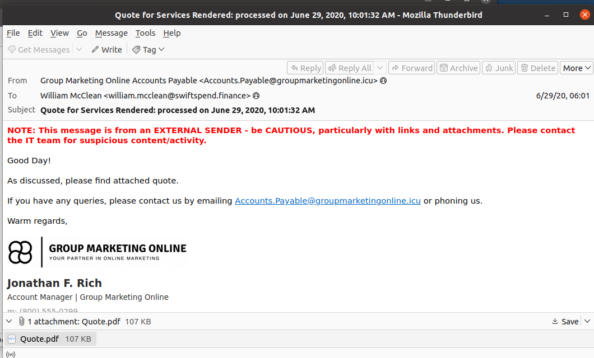
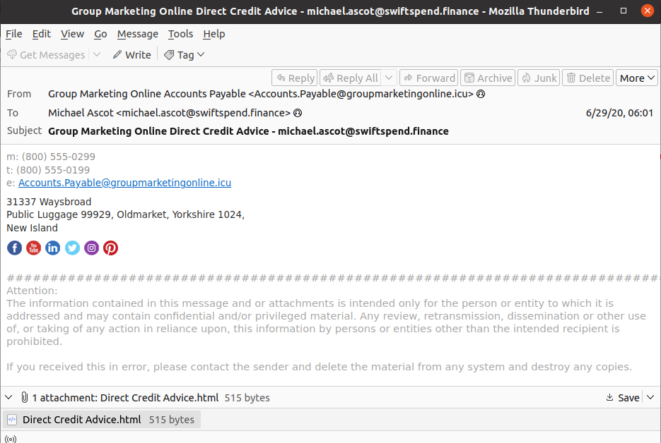
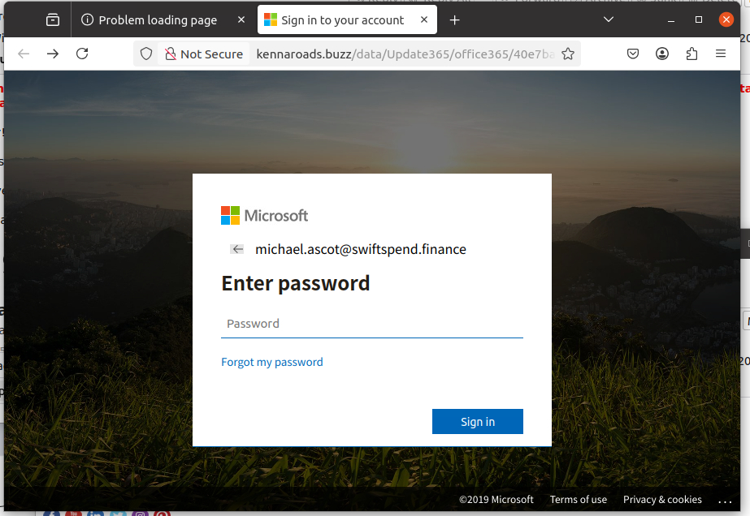
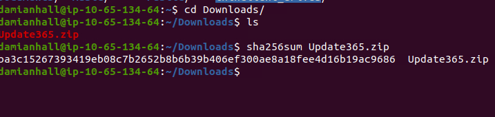
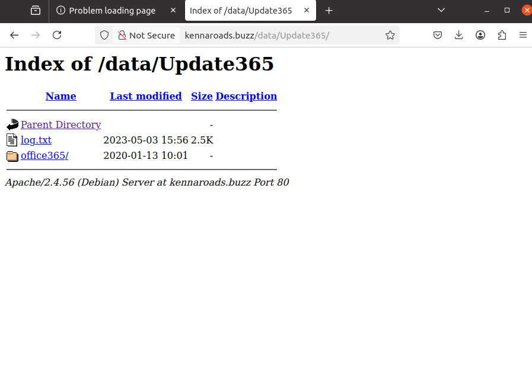
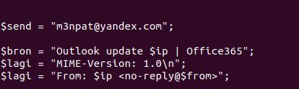

# 🛡️ Phishing Investigation – SwiftSpend Financial

## 📌 Overview
This project documents a phishing investigation conducted in a simulated enterprise environment provided through TryHackMe.

As a member of the IT department at SwiftSpend Financial, multiple employees reported receiving suspicious emails. Several users submitted their credentials, leading to potential account compromise.

The objective of this investigation was to analyze phishing emails, identify indicators of compromise (IOCs), investigate attacker infrastructure, and examine the phishing kit used during the attack.

---

# 🎯 Objectives

- Analyze phishing email samples
- Identify malicious sender infrastructure
- Investigate phishing URLs and redirections
- Retrieve and analyze the phishing kit
- Gather cyber threat intelligence (CTI)
- Identify compromised credentials
- Extract indicators of compromise (IOCs)

---

# 🧰 Tools Used

| Tool | Purpose |
|---|---|
| VirusTotal | Threat intelligence analysis |
| CyberChef | Decoding & data analysis |
| Linux CLI | File investigation |
| sha256sum | File hashing |
| PHP Source Analysis | Phishing kit investigation |

---

# 📧 Initial Phishing Email Analysis

The investigation began by reviewing suspicious emails reported by employees across multiple departments at SwiftSpend Financial.

Analysis of the messages revealed multiple phishing indicators commonly associated with credential harvesting campaigns.

## 🚩 Identified Indicators

- Suspicious sender domain
- External sender warning
- Malicious attachment
- Credential harvesting infrastructure
- Microsoft impersonation

## 📨 Sender Information

| Field | Value |
|---|---|
| Sender | Accounts.Payable@groupmarketingonline.icu |
| Domain | groupmarketingonline.icu |
| Impersonated Brand | Microsoft 365 |

# 📸 Investigation Screenshots

## 📧 Initial Phishing Email

---

## 📨 Additional Phishing Email

---

## 🎭 Fake Microsoft Login Portal

---

## 🌐 Exposed Directory Listing

---

## 🔐 SHA256 File Hashing

---

## 📂 Exposed Credential Log Directory

---

## 🧬 Credential Exfiltration Evidence

---
